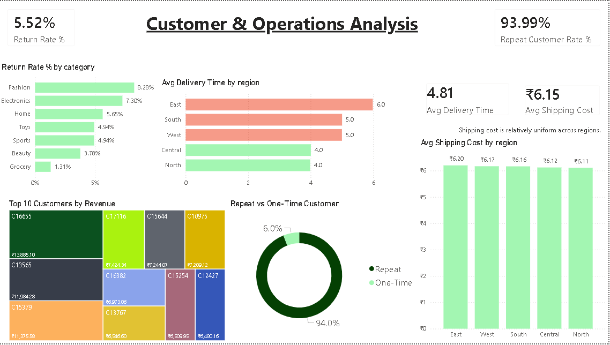

# E-commerce SQL + Power BI Performance Analysis

## Project Overview

This project delivers an end-to-end E-commerce performance analysis using:

* **SQL Server** for data extraction, transformation, and business metric computation
* **Power BI** for data modeling and interactive dashboard development

The objective is to translate raw transactional data into decision-ready insights across revenue, profitability, customers, and operations.

---

## Business Questions Addressed

1. How does revenue change over time?
2. Who are the top customers by revenue?
3. Which product categories generate the most revenue?
4. How does profit vary by category and region?
5. How are transactions distributed across payment methods?
6. What is the proportion of repeat vs one-time customers?
7. What is the return rate across product categories?
8. How does delivery performance vary by region?
9. Which regions generate the highest profit?
10. How do shipping costs differ across regions?

---

## Tools & Technologies

* SQL Server
* Power BI
* DAX
* Data Modeling
* Data Visualization

---

## Dashboard Structure

### Page 1 – E-commerce Performance Dashboard

Focus: Revenue & Profitability Overview

Includes:

Total Revenue

Total Profit

Total Orders

Profit Margin %

Monthly Revenue Trend

Category-wise Revenue & Profit

Regional Revenue & Profit

Payment Method Distribution

---

### Page 2 – Customer & Operations Analysis

Focus: Customer Behavior & Operational Metrics

Includes:

Return Rate by Category

Repeat vs One-Time Customer Distribution

Average Delivery Time by Region

Average Shipping Cost by Region

Top 10 Customers by Revenue

---

## Key Insights

* **Electronics** generates the highest revenue and profit.
* **Grocery** contributes revenue but operates at a loss.
* Revenue trend shows steady growth with seasonal fluctuations.
* Credit Card and Debit Card dominate payment transactions.
* Customer base is heavily skewed toward repeat buyers.
* Delivery time varies moderately across regions.
* Shipping costs remain relatively uniform across regions.

---
ecommerce-sql-powerbi-analysis/
│
├── dashboard/
│   ├── Ecommerce_SQL_PowerBI_Project.pbix
│   └── Ecommerce_SQL_PowerBI_Project.pdf
│
├── images/
│   ├── page1.png
│   └── page2.png
│
└── README.md

---

## Outcome

This project demonstrates:

* Translating business questions into analytical logic
* SQL-based data exploration and metric derivation
* DAX-driven KPI creation
* Multi-page executive dashboard architecture
* Structured insight communication through visualization

---

## Related SQL Project

This Power BI dashboard is built on top of the SQL analysis layer:

🔗 [https://github.com/vikramjeetsingh05/ecommerce-sql-analysis](https://github.com/vikramjeetsingh05/ecommerce-sql-analysis)

---
